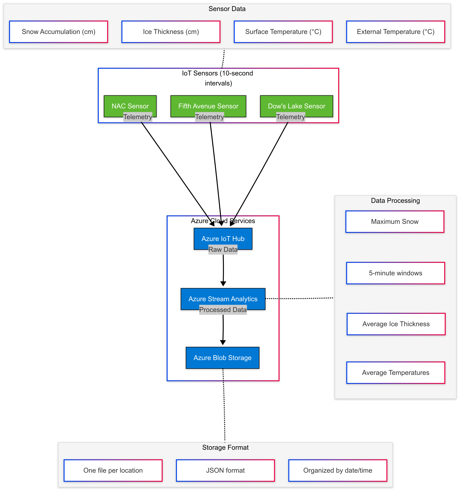
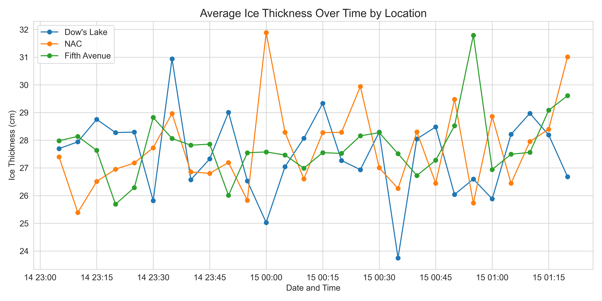
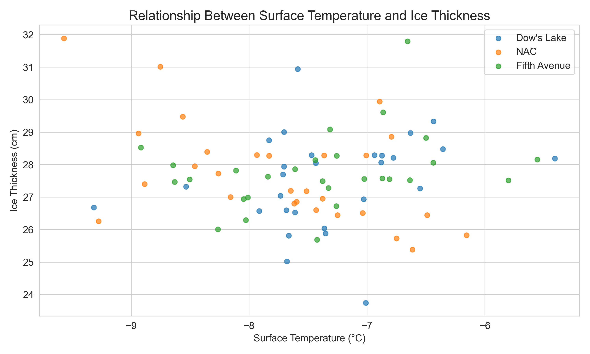
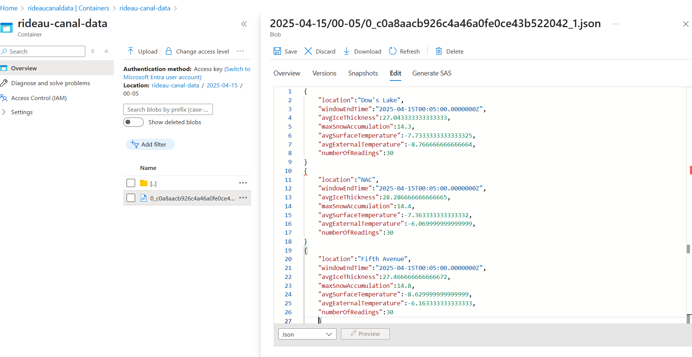

# Real-time Monitoring System for Rideau Canal Skateway

## Scenario Description

The Rideau Canal Skateway is a 7.8 km long skating rink in Ottawa, Canada, recognized as the world's largest naturally frozen skating rink by the Guinness Book of World Records. Every winter, the canal transforms into a skating venue, attracting thousands of visitors daily.

Safety is a primary concern for the National Capital Commission (NCC), which manages the skateway. Maintaining safe ice conditions requires constant monitoring of various environmental factors including ice thickness, surface temperature, snow accumulation, and external temperature.

This project implements a real-time monitoring system that:
1. Simulates IoT sensors at three key locations along the Rideau Canal Skateway (Dow's Lake, Fifth Avenue, and NAC)
2. Processes incoming sensor data to detect and aggregate conditions using Azure Stream Analytics
3. Stores processed data in Azure Blob Storage for further analysis and decision-making

The system enables officials to make informed decisions about skateway safety and maintenance, enhancing visitor experience while prioritizing safety.

## System Architecture



The system consists of the following components:

1. **IoT Sensors**: Three simulated sensors (at Dow's Lake, Fifth Avenue, and NAC) measure ice thickness, surface temperature, snow accumulation, and external temperature every 10 seconds.

2. **Azure IoT Hub**: Acts as the central message hub for bi-directional communication between the IoT sensors and cloud services.

3. **Azure Stream Analytics**: Processes incoming sensor data in real-time, aggregating measurements over 5-minute windows.

4. **Azure Blob Storage**: Stores the processed data for long-term retention and further analysis.

The data flow follows this sequence:
- Sensors collect measurements every 10 seconds and send them to Azure IoT Hub
- IoT Hub routes these messages to Stream Analytics
- Stream Analytics processes the data (calculating averages, maximums) over 5-minute windows
- The processed data is stored in Azure Blob Storage in JSON format

## Implementation Details

### IoT Sensor Simulation

The IoT sensors are simulated using a Python script (`sensor_simulator.py`) that generates realistic values for:
- Ice thickness (cm)
- Surface temperature (°C)
- Snow accumulation (cm)
- External temperature (°C)

For each sensor location, the script creates a telemetry message in JSON format:

```json
{
  "location": "Dow's Lake",
  "iceThickness": 27.3,
  "surfaceTemperature": -1.5,
  "snowAccumulation": 8.2,
  "externalTemperature": -4.3,
  "timestamp": "2025-04-13T12:00:00Z"
}
```

The script uses the Azure IoT Device SDK for Python to establish a connection with Azure IoT Hub and send the telemetry messages every 10 seconds.

### Azure IoT Hub Configuration

Azure IoT Hub is configured with:

1. **IoT Devices**: Three devices registered in IoT Hub, one for each location (Dow's Lake, Fifth Avenue, and NAC).
2. **Message Routing**: A route is set up to send all telemetry messages to a Stream Analytics job.
3. **Shared Access Policies**: Appropriate policies configured for device registration and management.

### Azure Stream Analytics Job

The Stream Analytics job is configured with:

1. **Input**: IoT Hub as the data source
2. **Query**: A SQL query that:
   - Groups data by location
   - Uses a 5-minute tumbling window
   - Calculates average ice thickness, maximum snow accumulation, average surface temperature, and average external temperature

```sql
SELECT
    location,
    System.Timestamp() AS windowEndTime,
    AVG(iceThickness) AS avgIceThickness,
    MAX(snowAccumulation) AS maxSnowAccumulation,
    AVG(surfaceTemperature) AS avgSurfaceTemperature,
    AVG(externalTemperature) AS avgExternalTemperature,
    COUNT(*) AS numberOfReadings
INTO
    [rideau-canal-output]
FROM
    [rideau-canal-input]
GROUP BY
    location,
    TumblingWindow(minute, 5)
```

3. **Output**: Azure Blob Storage as the destination for processed data

### Azure Blob Storage

The processed data is stored in Azure Blob Storage with the following structure:

- Container: `rideau-canal-data`
- Folder structure: `/{date}/{time}`
- File format: JSON
- File naming convention: `{location}_{windowEndTime}.json`

Sample output:
```json
{
  "location": "Dow's Lake",
  "windowEndTime": "2025-04-13T12:05:00Z",
  "avgIceThickness": 26.8,
  "maxSnowAccumulation": 9.1,
  "avgSurfaceTemperature": -1.7,
  "avgExternalTemperature": -4.5,
  "numberOfReadings": 30
}
```

## Usage Instructions

### Running the IoT Sensor Simulation

1. Install the required Python packages:
   ```
   pip install -r requirements.txt
   ```

2. Update the connection strings in `sensor_simulator.py`:
   - Open the file and replace the placeholder connection strings with your actual Azure IoT Hub device connection strings
   ```python
   DEVICE_CONNECTION_STRINGS = {
       "Dow's Lake": "YOUR_DOWS_LAKE_CONNECTION_STRING",
       "Fifth Avenue": "YOUR_FIFTH_AVENUE_CONNECTION_STRING",
       "NAC": "YOUR_NAC_CONNECTION_STRING"
   }
   ```

3. Run the simulation script:
   ```
   python sensor_simulator.py
   ```
   
   The script will start sending simulated sensor data to Azure IoT Hub every 10 seconds.

### Configuring Azure Services

#### Azure IoT Hub Setup

1. Create an Azure IoT Hub:
   - Sign in to the Azure portal
   - Click "Create a resource" > "Internet of Things" > "IoT Hub"
   - Fill in the required details (name, resource group, region, etc.)
   - Select the appropriate pricing tier (S1 is recommended for this project)
   - Click "Review + create" > "Create"

2. Register devices in IoT Hub:
   - Navigate to your IoT Hub resource
   - Go to "Devices" under "Device management"
   - Click "+ Add Device"
   - Create three devices with IDs: "dows-lake-sensor", "fifth-avenue-sensor", and "nac-sensor"
   - Note down the connection strings for each device (used in the simulation script)

#### Azure Stream Analytics Setup

1. Create a Stream Analytics job:
   - In the Azure portal, click "Create a resource" > "Analytics" > "Stream Analytics job"
   - Provide a name, resource group, and location
   - Click "Create"

2. Configure the job input:
   - In your Stream Analytics job, go to "Inputs" under "Job topology"
   - Click "+ Add stream input" > "IoT Hub"
   - Provide a name (e.g., "rideau-canal-input")
   - Select your IoT Hub from the dropdown
   - Keep the defaults for other settings
   - Click "Save"

3. Configure the job output:
   - Go to "Outputs" under "Job topology"
   - Click "+ Add" > "Blob storage/ADLS Gen2"
   - Provide a name (e.g., "rideau-canal-output")
   - Select or create a storage account
   - Create or select a container (e.g., "rideau-canal-data")
   - Set path pattern to "{date}/{time}"
   - Set Authentication mode to "Connection string"
   - Set Event serialization format to "JSON"
   - Set Format to "Line separated"
   - Click "Save"

4. Configure the query:
   - Go to "Query" under "Job topology"
   - Paste the SQL query from the `stream_analytics_query.sql` file
   - Click "Save query"

5. Start the job:
   - Go to "Overview"
   - Click "Start" > "Now" > "Start"

#### Azure Blob Storage Setup

1. Create a storage account (if not already created during Stream Analytics setup):
   - In the Azure portal, click "Create a resource" > "Storage" > "Storage account"
   - Fill in the required details
   - Click "Review + create" > "Create"

2. Create a container:
   - Navigate to your storage account
   - Go to "Containers" under "Data storage"
   - Click "+ Container"
   - Name it "rideau-canal-data"
   - Set public access level to "Private"
   - Click "Create"

### Accessing Stored Data

1. Navigate to your storage account in the Azure portal
2. Go to "Containers" under "Data storage"
3. Click on the "rideau-canal-data" container
4. Browse through the folder structure (organized by date and time)
5. Click on any JSON file to view the processed data

Alternatively, you can use Storage Explorer:
1. Download and install Azure Storage Explorer
2. Connect to your storage account using the connection string
3. Navigate to the "rideau-canal-data" container
4. Browse and download files as needed

### Data Visualization

Using AI, a simple Python program was generated using the Pandas library for data visualization and analysis (visualization folder).
To visualize the collected data:

1. Install additional required packages:
   ```
   pip install azure-storage-blob pandas matplotlib seaborn
   ```

2. Use the provided visualization script:
   ```
   python simple_visualizer.py "YOUR_STORAGE_ACCOUNT_CONNECTION_STRING"
   ```
   
3. The script will:
   - Connect to your Azure Blob Storage
   - Retrieve and process all JSON data files
   - Generate visual charts for ice thickness, snow accumulation, and temperature relationships
   - Create a summary statistics file
   - Generate a comprehensive results analysis

## Results

The real-time monitoring system successfully collected and processed sensor data from three key locations along the Rideau Canal Skateway over a two-hour period. The system aggregated 30 readings per 5-minute window across all three locations.

### Aggregated Data Analysis

The Stream Analytics job aggregated data into 5-minute windows, calculating average values for key metrics. Sample aggregated output is shown below:

| Location | Time Window | Avg Ice Thickness (cm) | Max Snow Accumulation (cm) | Avg Surface Temp (°C) |
|----------|-------------|------------------------|----------------------------|------------------------|
| Dow's Lake | 2025-04-14T23:55:00Z | 31.63 | 14.0 | -7.63 |
| NAC | 2025-04-14T23:55:00Z | 27.57 | 13.4 | -4.13 |
| Fifth Avenue | 2025-04-14T23:55:00Z | 27.55 | 14.7 | -8.20 |

### Key Findings

#### Ice Thickness Patterns



The visualization reveals several important insights:

1. **Significant Fluctuations**: Ice thickness varies considerably between approximately 24 cm and 32 cm over just a 2-hour monitoring period, demonstrating the importance of real-time monitoring for safety management.

2. **Location-Specific Variations**: Each monitoring point shows distinct patterns:
   - **NAC**: Shows the most dramatic peaks, reaching ~32 cm around midnight
   - **Fifth Avenue**: Demonstrates high variability, with a notable peak (~31.8 cm) around 1:00 AM
   - **Dow's Lake**: Experienced the most significant drop (to ~23.8 cm) around 12:30 AM, which could potentially trigger safety alerts

3. **Independent Patterns**: The three locations don't follow identical patterns, suggesting that local conditions affect ice thickness differently throughout the canal.

#### Temperature and Ice Relationships



Analysis of the relationship between surface temperature and ice thickness reveals:

1. **No Strong Linear Correlation**: There isn't a simple direct relationship between temperature and ice thickness in this timeframe.

2. **Temperature Range**: The system successfully captured surface temperatures from approximately -9.5°C to -6°C.

3. **Location-Specific Relationships**: Each location shows a slightly different pattern in how temperature relates to ice thickness, with NAC showing the widest range of thickness values.

4. **Thickest Ice Measurements**: The highest thickness readings (31-32 cm) occur across different temperatures, suggesting other factors may influence thickness beyond just temperature.

These visualizations demonstrate that the real-time monitoring system is successfully capturing meaningful variations in ice conditions that would be valuable for the National Capital Commission to make informed decisions about skateway safety and maintenance.

### Sample Outputs

Below are examples of the processed data stored in Azure Blob Storage:



These results provide valuable insights into the conditions of the Rideau Canal Skateway at different locations, allowing for prompt responses to any safety concerns.

## Reflection

### Challenges and Solutions

1. **Realistic Data Simulation**:
   - **Challenge**: Creating a simulation that generates realistic sensor values for the Rideau Canal environment.
   - **Solution**: Researched typical ice thickness and temperature ranges for the Ottawa region in winter. Implemented random value generation within these realistic bounds to simulate natural variations while maintaining plausible readings.

2. **Azure IoT Hub Configuration**:
   - **Challenge**: Setting up proper device registration and message routing.
   - **Solution**: Created individual device identities for each sensor location and carefully documented the connection strings. Implemented proper error handling in the Python script to ensure robust connections.

3. **Stream Analytics Query Optimization**:
   - **Challenge**: Determining the optimal window size for aggregation.
   - **Solution**: After testing different window sizes, a 5-minute tumbling window was chosen as it provides a good balance between timely updates and meaningful aggregation of data.

4. **Data Visualization**:
   - **Challenge**: Creating meaningful visualizations from time-series IoT data.
   - **Solution**: Implemented a Python-based visualization solution that automatically extracts data from Azure Blob Storage and generates insightful charts that clearly show patterns and relationships in the data.

5. **Asynchronous Programming**:
   - **Challenge**: Managing multiple concurrent sensor simulations.
   - **Solution**: Implemented Python's asyncio library to run all sensor simulations concurrently, ensuring efficient resource usage and simplified code structure.

### Future Improvements

1. **Dynamic Thresholds**: Implement adaptive thresholds for safety conditions based on historical data and weather forecasts.

2. **Alert System**: Add a real-time alerting system that notifies maintenance teams when conditions approach unsafe levels.

3. **Mobile Application**: Develop a companion mobile app that displays current conditions to the public and maintenance staff.

4. **Machine Learning Integration**: Implement predictive analytics to forecast ice conditions based on weather patterns and historical data.

5. **Additional Sensors**: Expand the system to include more sensor locations and additional measurements such as wind speed and humidity.

This project demonstrates the potential of IoT and cloud technologies in enhancing public safety and resource management. The real-time monitoring system provides valuable insights that can help the National Capital Commission maintain the Rideau Canal Skateway as a safe and enjoyable attraction for visitors.
